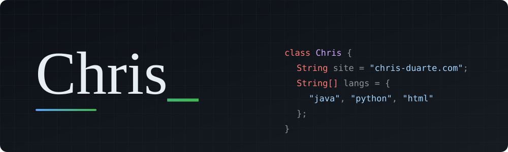
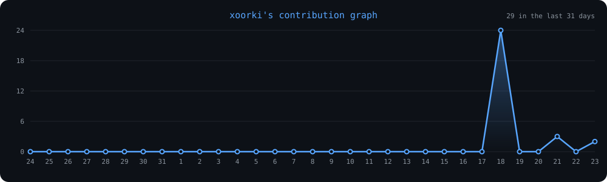

  

### about

Computer science student building things for the web and learning how software works from the ground up. Studying Leaving Cert Computer Science: algorithms, computational thinking, data, and embedded systems.

🌐 [chris-duarte.com](https://chris-duarte.com) • ✉️ [chris@chris-duarte.com](mailto:chris@chris-duarte.com) • 💼 [linkedin](https://www.linkedin.com/in/chr1sduarte)

---

### core skills

  

- **languages:** java • python • javascript • html • css • sql
- **algorithms:** linear & binary search • bubble, insertion, selection & quicksort • recursion • big-o complexity
- **data:** csv & json handling • data analysis & visualisation • basic relational databases
- **embedded systems:** micro:bit • arduino • sensors & inputs/outputs
- **computational thinking:** abstraction • decomposition • pattern recognition • debugging & testing
- **tools:** git • github • vs code • github pages • cloudflare

---

  

